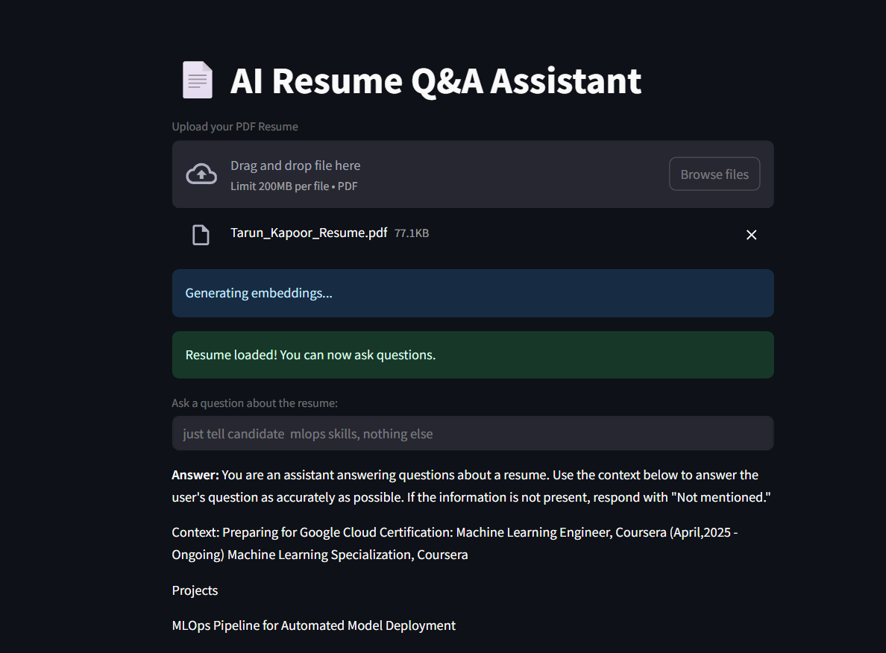

# 📄 AI Resume Q&A Assistant
---
An interactive Resume Q&A assistant built with Streamlit, LangChain, FAISS, and HuggingFace models. Upload your resume (PDF), and ask questions to get intelligent answers based on its content.

# Features
---
✅ Upload PDF resumes

🔍 Extracts and splits resume content into chunks

💡 Uses HuggingFace sentence-transformers to embed the resume

🧠 Leverages FAISS for vector similarity search

🤖 Generates answers using Flan-T5 (via HuggingFace pipeline)

🧾 Answers questions based only on resume content

🔐 Shows exact chunks used to answer each question
